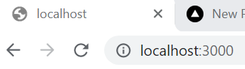

# CMS examination

This project is built in React.js using wordpress.com as cms.

## Getting started

### Installation

Depending on

1. Clone the repo (or fork if you want to deploy on your own)
   ```sh
   git clone https://github.com/KDollmayer/cmsinla
   ```
2. Install NPM packages
   ```sh
   npm install
   ```
3. Add an .env file at the Client directory and add your API_URL
   ```js
   REACT_APP_API_URL = "ENTER YOUR URL";
   ```
4. You need a wordpress account for posting new blog posts. Contact admin to get access.

## Run the project locally

To run the project:

```js
npm start
```

You should now be able to see your WordPress.com content displayed on localhost.



## Deploy

This project is deployed with Vercel.

## Deploy on your own

1. Go to [vercel](vercel.com) and create an account / log in.
2. Click the Add New button and choose Project.
3. Connect your Github to Vercel
4. Import your repository
5. Select the Client-folder as Root Directory
6. Add environment variables (same as in your .env file)
7. Deploy project

## Contact

Admin Karl Dollmayer - karldollmayer@gmail.com

Project Link: [https://github.com/KDollmayer/cmsinla](https://github.com/KDollmayer/cmsinla)]
